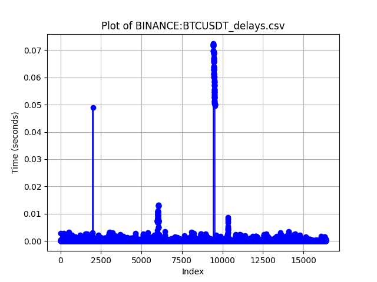
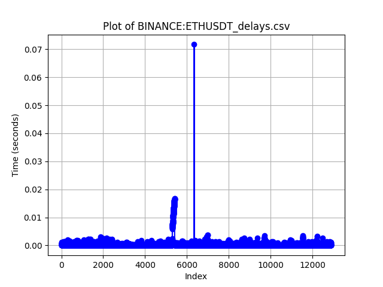
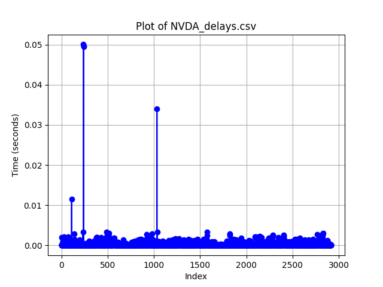
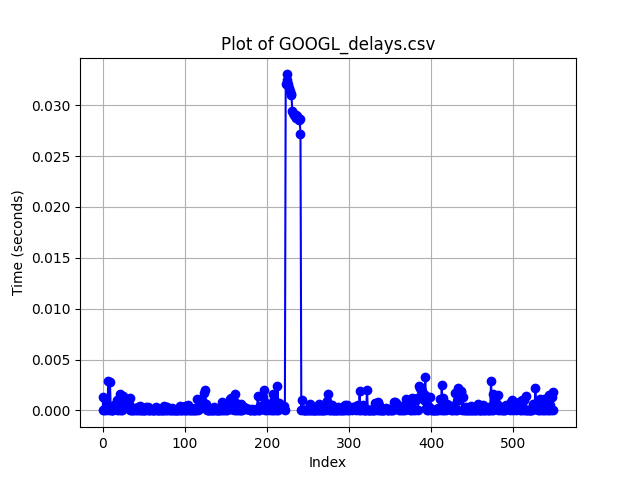

# Real-time embedded systems assignment
Name:   
AEM:   
GitHub repository: [https://github.com/Kou-ding/Real-Time-Embedded-Systems](https://github.com/Kou-ding/Real-Time-Embedded-Systems)

## **Introduction**
In this assignment, we are going to be opening a WebSocket connection to receive and process stock and crypto data. We are going to be keeping track of the following stocks and crypto alike:
- Invidia,
- Google,
- Bitcoin,
- Ethereum.  

Stocks and crypto have differing operating hours and that is why I chose to incorporate, in addition to stocks that are exchanged on normal stock market hours, two very popular cryptocurrencies that are being exchanged 24/7. This setup will provide us with a constant influx of sufficient data to process.

## **WebSockets & Python | Part 1**

#### Finnhub account
First, we have to make an account in [Finnhub](https://finnhub.io) so that we can get an API key. Finnhub is a financial API organized around REST and the key it gives us is used to authenticate our specific requests.

#### Python example
To test the functionality of the web socket we run a Python script after activating the correct environment that contains the necessary dependencies.

What we receive for currently traded markets (in our case: Bitcoin) is:
```
++Rcv decoded: fin=1 opcode=1 data=b'{"data":[{"c":null,"p":66972.77,"s":"BINANCE:BTCUSDT","t":1721555886208,"v":0.01559}],"type":"trade"}
```
What we receive for not-currently traded markets (in our case: Apple) is:
```
++Rcv decoded: fin=1 opcode=1 data=b'{"type":"ping"}'
{"type":"ping"}
```
The operating schedule of cryptocurrencies is 24/7 while normal stocks have certain market hours depending on the stock exchange they are on.

>Type: ping, signifies that the connection has been established though there are no market data to send.

>Type: trade, contains market data relevant to the symbols we subscribe to

The trade information being provided has this form:
- s: symbol
- p: last price, 
- v: volume,
- t: unix milliseconds timestamp,
- c: list of trade conditions

## **Websockets & C lang | Part 2**
Now that we know how Finnhub works and what kind of data it provides we need to do the same thing but in C and parallelize the process using pthreads.

> Note: The code has a lot of comments that go into the nuance of all the topics that could't make the cut to be included inside the report.

#### Installing web sockets C library
At this point, we need to install a library (libwebsockets) that will help us subscribe to certain market symbols. This is a functionality provided by the Finnhub API, effectively allowing us to listen to the current market's activity for certain stocks and/or cryptos.
> The dependencies installation process is different in native compiling and cross compiling. For a detailed tutorial on cross-compilation check the cross-compile.md file inside the GitHub repository.

#### Understanding Web Sockets
The C implementation helps us understand the fundamentals of a web socket connection. These are as follows:
- Step 1
    - Send an HTTP request to the server asking to open a connection
- Step 2
    - The server sends a response to the client 101 Switching Protocols
- Step 3
    - The channel is now open for bidirectional communication.

Steps 1 and 2 are considered the handshake procedure and in our case, we subscribe to certain Stocks and receive the same information as the Python script we tried earlier.

#### Libwebsocket code
Let's translate the previously stated WebSocket theory into actual c code.
The gist of the program's logic is within the WebSocket service callback function. A callback function is designed to be called by another function. In our case, this stands true as it gets called on different occasions:
- When creating the context of the connection the callback function is passed as a parameter to the protocols array.
- Every time the main while loop comes around to ensure that the WebSocket continues serving its purpose. Specifically, this is the function that utilizes it: lws_service(context, 500).

The aforementioned callback function contains all of the possible connection states:
- The Client established a connection
- Connection error
- Connection closed
- The Client received a message
- Client writeable

Before receiving a message the program must first succeed in a handshake with the server. This is implicitly managed by the libwebsockets library. When the connection is established the callback function runs the "callback client established" case which changes a public flag to let us know of the connection's updated state. The "callback client writeable" case is where we pass on the market symbols to initiate the subscription process. The server will then provide us with a constant flow of market data. This is done in the "callback client received" case of the callback function. Here we analyze the JSON formatted message that is sent through the WebSocket connection to extract the data. 

#### P threads 
Finally, we need to parallelize the c code using p threads so that we meet the real-time demands of our application. We will be assigning one producer and one consumer to each stock. They are going to be making use of a circular queue unique for each stock. The producer function adds trade data to the queue and the consumer takes them out in due time to:
- log some recent trades in a text file, 
- calculate the candlestick and store it in a text file and 
- calculate the 15-minute moving average of each symbol logging it as well in a text file.

We utilize a mutex so that only one thread can give or take from the queue at a particular moment in time. Finally, we set some variable arrays, that have as many elements as there are threads, so that we can have unique, to each symbol, variables for each thread to work with and calculate times, values and everything that is needed.

## **Results | Part 3**

#### Enqueue / Dequeue Delay
Along with the other text files we instruct the consumer threads to store the delay times, between the time a trade data was inserted into the queue and the time it was processed, inside a CSV file. Then, we can later on run a Python script to process and graph the delay times for each symbol. This benchmark tells us how real-time the calculations we do really are.

The plots we get after 4 hours are as follows:






Most of the results are processed in less than 5ms. There are some outliers but that could be attributed to the high influx of data in instances that the production speed mementarily exceeds greatly the consumption speed.

#### CPU Idle Percentage
The second benchmark we are going to perform involves calculating how much of the time the CPU remains idle awaiting trades to appear inside the individual queues to process them. Longer CPU idling plays a huge role in keeping the program energy efficient, allowing it to function for prolonged periods without the need for a constant supply of power. Thus the system can very well function through an integrated battery.

Here are some measurements of the CPU Idle Percentage for reference:
|Execution time|CPU Idle %|
|--------------|----------|
|312.8130 seconds|89.9085%|
|610.9161 seconds|99.8574%|
|1187.7881 seconds|74.2154%|
|1975.7935 seconds|99.9589%|
|13845.7241 seconds|77.6013%|

As we see the majority of the time the processor remains idle, waiting for the trade data to come through. The percentage may vary depending on external factors.

> Note that the production CPU time, where we pass the JSON data to our individual queues, was considered insignificant and was left out.


## **Observations | Part 4**
When setting up the protocol array I originally set the buffer size at 1000. This allowed me to read the entirety of the messages being sent, but once in a while, the connection would terminate without any obvious, for me, reason. Setting the buffer to 0 resolved the issue.

There seems to be an occurrence where the WebSocket connection terminates on its own after a couple of hours. The connection flag remains 1, indicating that the connection is still open when in reality we are not receiving any data. This makes it difficult for us to attempt a reconnection since there isn't any variable that can inform us that the connection has been disrupted.

Specifying the SSL certificate file was not necessary when running the program natively. However, when it comes to cross-compilation the executable appeared to struggle to find the certificate. That is why we needed to add the host's SSL certificate directory to the context creation info. 

**Sources**
-----------------------------------------------------
- https://stackoverflow.com/questions/30904560/libwebsocket-client-example
- https://finnhub.io/docs/api/library
- https://github.com/Finnhub-Stock-API/finnhub-python
- https://github.com/warmcat/libwebsockets
- https://github.com/openssl/openssl
- https://github.com/akheron/jansson
- https://jansson.readthedocs.io/en/latest/gettingstarted.html#compiling-and-installing-jansson
- https://www.youtube.com/watch?v=SoGsKI_nrYU&t=35s
- https://jensd.be/1126/linux/cross-compiling-for-arm-or-aarch64-on-debian-or-ubuntu
- https://musl.cc/aarch64-linux-musl-cross.tgz
- https://chatgpt.com

